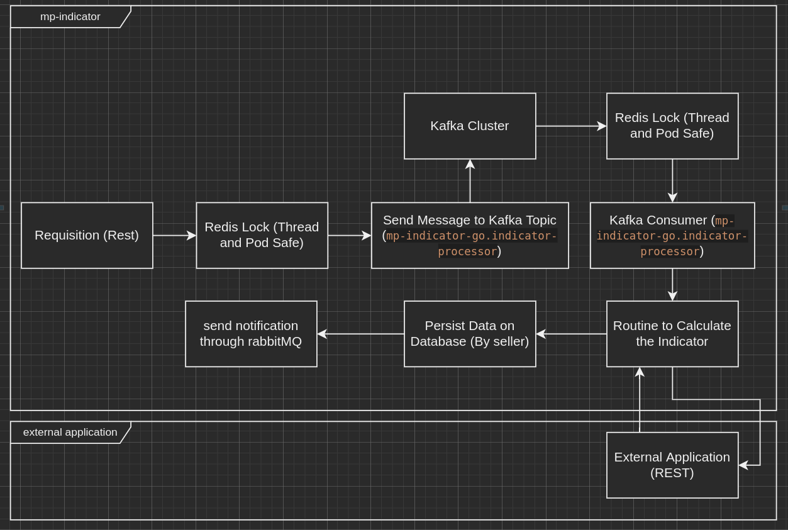

# Mp-Indicator-Go:

## Main Goals:

- It's an application to allow me to have contact with the main technologies used by me at work but in the Golang world.

## Application Goals:

- It's a fake application which extract's some data from other service and summarize and normalize to its database to
  allow to make available some indicators based on this data.
- The main architecture is based on the image bellow:
    - Important: It's not the best architecture based on golang language (I used the kafka cluster to provide the load
      balance between pods and threads) but as I said before, this application it's a case study so this architecture
      was the one that allowed me to use all technologies I use right now at my everyday work.

## Technologies Used:

- Kafka
- RabbitMQ
- Redis
- Redis Memory Lock
- Docker & Kubernetes
- Redis distributed lock
